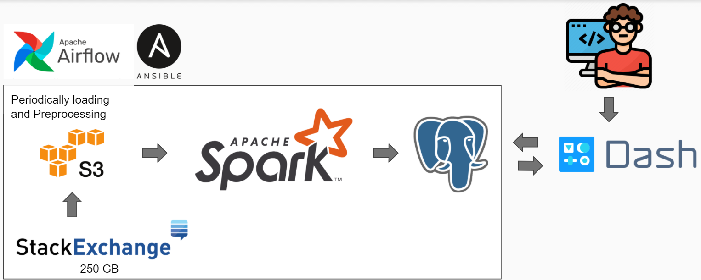
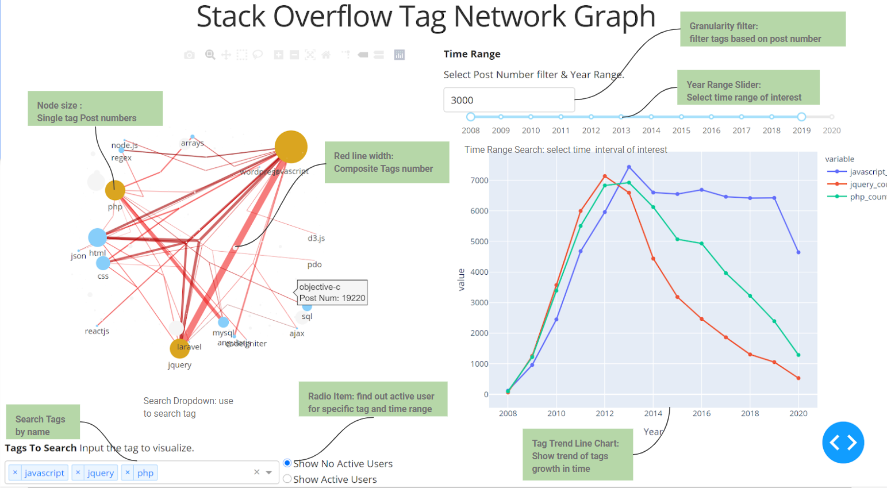

# Insight Data Engineer Project

- PROBLEM STATEMENT:

    Having a strong and supportive community for technology tool is one of important factor for tech company to decide whether they want to adopt this tool among all potential tools. However, there is no obvious way of finding out the activeness between one group with another.

- SOLUTION:

    By construct a ETL pipe line for preprocessing stack overflow data and stored in database, the network graph and trend of growth among tags group can be visualized on the Dash-based user interface that provide multiple function support analysis. This project showcased the ability of building a ETL pipeline for processing big data (250GB) and Full-stack software skill as well as data analysis.

[Temp Demo website](http://insightdataengineer.online/) | [Slide](https://docs.google.com/presentation/d/1sbWKLwaT2vLml31VI6-uxXzdjK5P2kiTAZ9GfWRD1sY/edit?usp=sharing) | [Demo Vedio](https://www.youtube.com/watch?v=rGT3rbSUN10)

# Installation/DevOp
- Use Ansible to provision EC2, install spark, postgres and Dash UI. (Refer to [DevOp](https://github.com/Shawn5141/Stack-Community/tree/master/DevOp) folder for further instrution)
- Link the DNS of EC2 to public domain (Not done yet)

# ETL Pipeline

- Tech Stack:

Upload xml file downloaded from stack exchange data dump to s3. And use spark cluster to preprocessed posts data and user data. After pre-computation, the result table is stored in database which can be access by front end UI. (Ref to [ETLPipeline](https://github.com/Shawn5141/Stack-Community/tree/master/ETLPipeline)) folder.

# App
- After installation and preprocessing. You can run the Dash App by `python app.py` in App directory. In [APP](https://github.com/Shawn5141/Stack-Community/tree/master/App), it displays the design of user interface using Dash. 
- The UI implemented with multiple function. Function demo refer to this [youtube vedio](https://www.youtube.com/watch?v=rGT3rbSUN10).And function descriptions are shown below:

